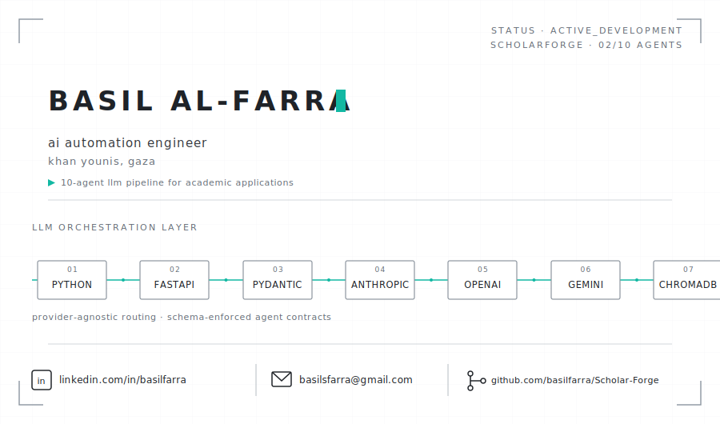
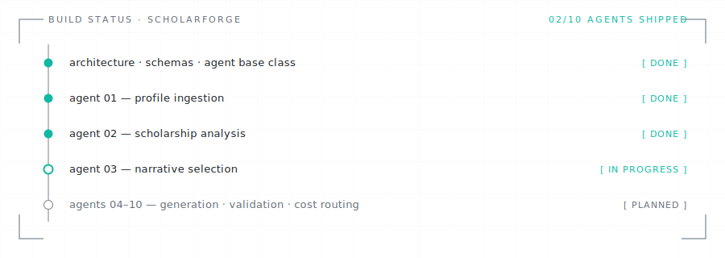

<picture>
  <source media="(prefers-color-scheme: dark)" srcset="assets/identity-dark.svg">
  
</picture>

**Also shipped in production:** `Laravel` · `CodeIgniter` · `Angular` · `RESTful APIs` · `SQL optimization` — **Tooling:** `Git` · `Docker` · `Figma`

---

### `ABOUT`

I design and ship LLM-orchestration systems — pipelines where multiple specialized agents, not a single prompt, produce work that has to survive scrutiny. My background spans backend engineering (Laravel, CodeIgniter, Angular), an MBA in IT & Communication (TAG-GDU), and several years of freelance academic consulting — building CVs, motivation letters, and application strategy for scholarship applicants under real committee-level pressure.

That last part isn't incidental. It's where ScholarForge came from.

I build and ship from Khan Younis, Gaza, under active infrastructure constraints. That fact shapes how I work more than how I talk about it: async-first workflows, disciplined scope, and shipping in increments that survive interrupted connectivity — not a caveat, an operating constraint I design around.

---

### `CURRENTLY BUILDING` — [ScholarForge](https://github.com/basilfarra/Scholar-Forge)

  

**The problem:** thousands of scholarship applicants submit AI-generated motivation letters that all read the same — *"Since childhood, I have been passionate about..."* Committees notice. Single-prompt generators make this worse, not better.

**The approach:** a 10-agent orchestration pipeline that reverse-engineers a scholarship's actual evaluation rubric, selects which parts of an applicant's story serve *that specific application*, generates documents against the rubric instead of a template, and puts every claim through a hostile-reviewer simulation before it reaches the applicant.

**Where it actually stands right now** — no rounding up:

<picture>
  <source media="(prefers-color-scheme: dark)" srcset="assets/status-board-dark.svg">
  
</picture>

Full architecture, agent specs, and roadmap are documented in the [repo itself](https://github.com/basilfarra/Scholar-Forge) — I keep it honest there on purpose, including what's *not* built yet.

**Why I'm building it:** I've done this work by hand. Over the past several months I supported 30+ students through competitive scholarship applications — manually orchestrating multiple LLMs in parallel, comparing outputs, catching hallucinations, iterating until a document could survive committee scrutiny. ScholarForge encodes that process into software instead of repeating it by hand every time.

---

  <code>EOF</code> · Basil Al-Farra · Khan Younis, Gaza

